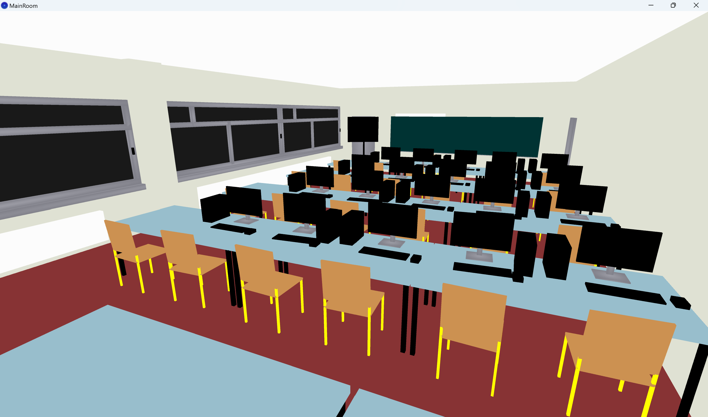
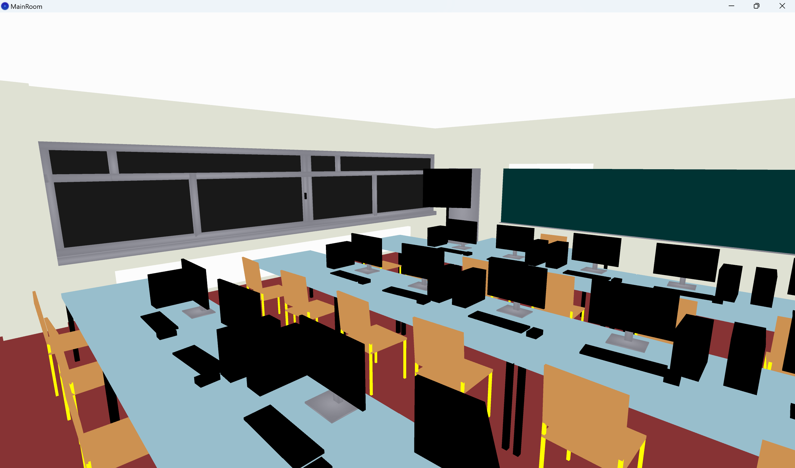
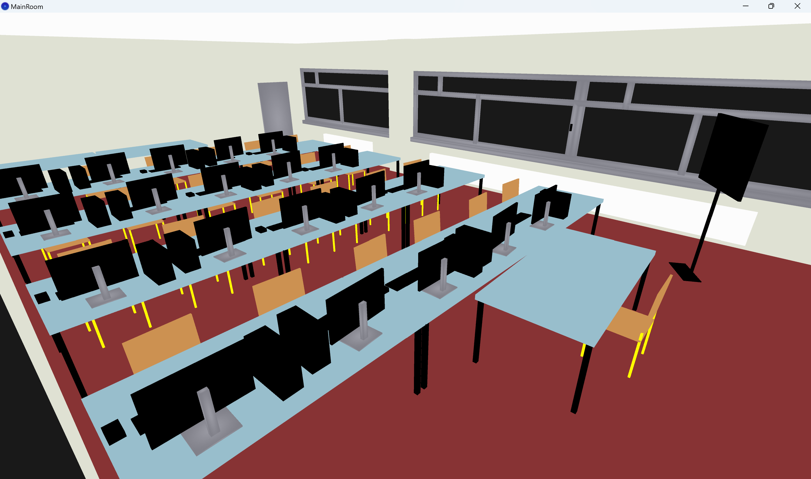
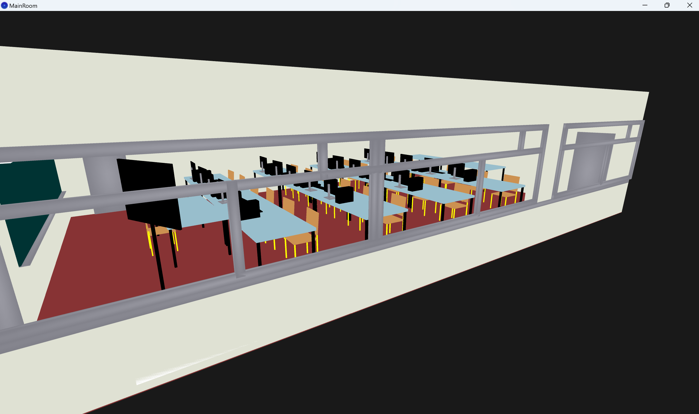

# Projet Infographie-Salle 106

## Auteur:
|Nom|Prénom|email|
|--|--|--|
| *LARAICH* | *Abir* | *abir.laraich@etu.univ-lehavre.fr* |

## Contexte du projet: 

Dans ce projet, nous allons créer une représentation numérique de la salle de TP A106 en utilisant toutes les techniques que nous avons apprises en classe. Nous allons positionner une caméra dans cette scène pour permettre l'observation sous différents angles.Nous allons également intégrer plusieurs sources lumineuses pour illuminer la pièce de manière réaliste. Les objets présents dans la salle seront modélisés, mais nous allons nous limiter à des formes simples comme des cubes déformés, sans avoir besoin de représenter des formes plus complexes telles que des cylindres. Enfin, nous allons appliquer des textures aux objets pour ajouter des détails visuels et rendre la scène plus authentique.

## Captures d'écran:

## Contrôles de Déplacement :

- **Avancer :** Touche `Z`
- **Reculer :** Touche `S`
- **Gauche :** Touche `Q`
- **Droite :** Touche `D`
- **Monter :** Touche `Espace`
- **Descendre :** Touche `Maj`
- **Rotation de la caméra :** Utilisez `la souris 🖱️`

